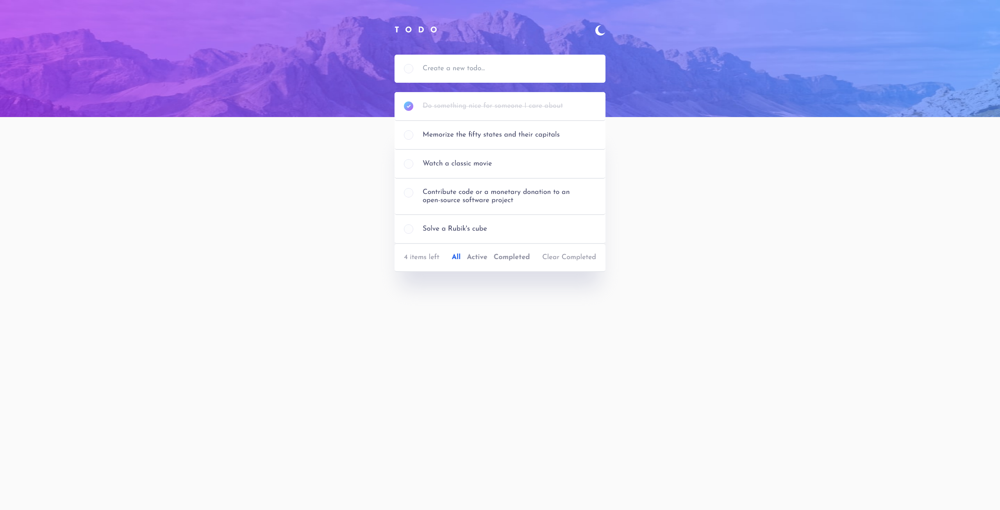
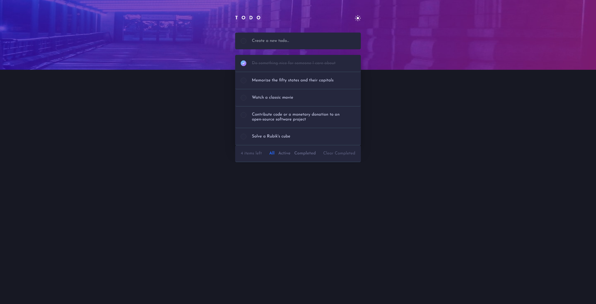

# Frontend Mentor - Todo app solution

This is a solution to the [Todo app challenge on Frontend Mentor](https://www.frontendmentor.io/challenges/todo-app-Su1_KokOW). Frontend Mentor challenges help you improve your coding skills by building realistic projects.

## Table of contents

- [Overview](#overview)
  - [The challenge](#the-challenge)
  - [Screenshot](#screenshot)
  - [Links](#links)
- [My process](#my-process)
  - [Built with](#built-with)
  - [What I learned](#what-i-learned)
  - [Useful resources](#useful-resources)

## Overview

### The challenge

Users should be able to:

- View the optimal layout for the app depending on their device's screen size
- See hover states for all interactive elements on the page
- Add new todos to the list
- Mark todos as complete
- Delete todos from the list
- Filter by all/active/complete todos
- Clear all completed todos
- Toggle light and dark mode
- **Bonus**: Drag and drop to reorder items on the list

### Screenshot

LightMode:

Darkmode:

### Links

- Solution URL: [Add solution URL here](https://www.frontendmentor.io/solutions/todoapp-with-react-typescript-and-testing-e2ecomponent-testing-swzIPhikMX)
- Live Site URL: [https://caner404.github.io/todo-react-app/](https://caner404.github.io/todo-react-app/)

## My process

### Built with

- [E2E-Testing(Cypress)](https://www.cypress.io/) - E2E Testing Library
- [Component-Testing (React-Testing-Library)](https://testing-library.com/docs/react-testing-library/intro/) - React Testing Library for component testing
- [Dummyjson](https://dummyjson.com/docs/todos) - JSON API for Todos
- [React](https://reactjs.org/) - JS library
- [TailwindCSS](https://tailwindcss.com/docs/installation) - For styling
- [Vite](https://vitejs.dev/) - Frontend Build tool
- [Vitest](https://vitest.dev/) - A Vite-native testing framework
- [Typescript](https://www.typescriptlang.org/) - Strongly tpyed programming language built on javascript

### What I learned

With this project, I wanted to gain my first knowledge of React and improve my testing skills at the same time. I came across the concept of "outside-in TDD" a while ago and found it very fascinating. With this project I wanted to improve my understanding of this concept.
With the concept of outside-in TDD, the first thing you do is write an E2E test that describes the feature you want to implement. This E2E test will fail at the beginning, like any test in TDD.
To get the E2E test executable correctly, you need to develop the implementation details such as a component. You can also write tests (component testing) for this component.
A link to the concept with an example in React or Vue is included in the README of the project

### Useful resources

- [Jonas Schmedtmann](https://codingheroes.io/) - Exceptional Frontend Tutor. Currently taking his React course.
- [Outside-In TDD](https://outsidein.dev/concepts/outside-in-tdd/) - Test-Driven-Development with an additional outer E2E Test. Really interesting concept for UI-Development.
- [Cypress Real World Example](https://learn.cypress.io/real-world-examples) - Really helpful free cypress tutorial
